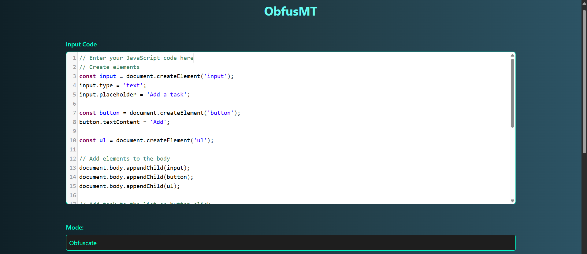
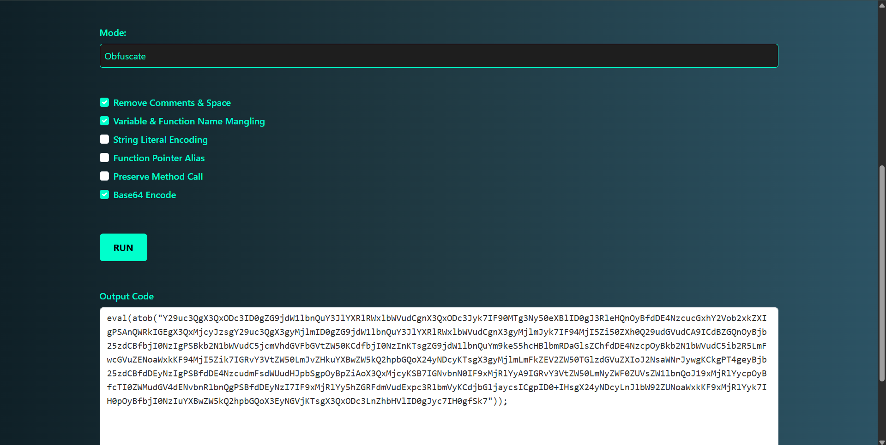
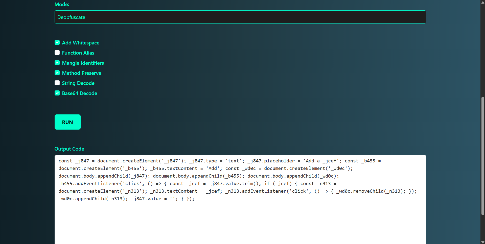
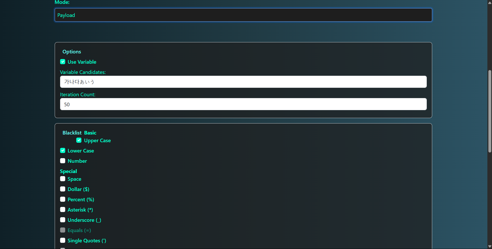
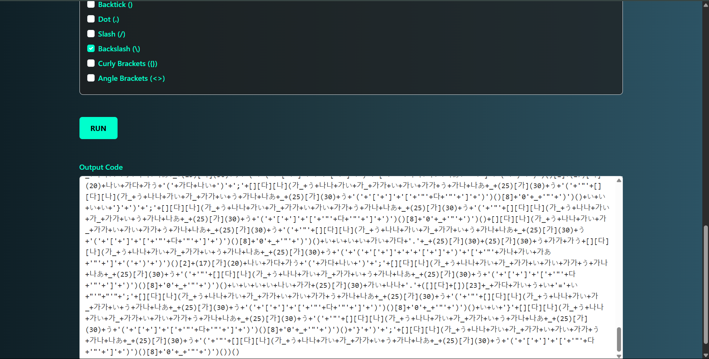

# ObfusMT-tool
ObfusMT is a full-stack web-based tool built to obfuscate, deobfuscate, and mutate code payloads for enhanced security, analysis, or transformation. It supports multiple techniques such as Base64 encoding, function aliasing, identifier mangling, and even exotic character payload generation.

* Features
   Obfuscate Mode
  Apply multiple obfuscation layers to your input code:

✅ Remove Comments & Whitespace

✅ Variable & Function Name Mangling

✅ Base64 Encode

⬜ String Literal Encoding

⬜ Function Pointer Alias

⬜ Preserve Method Calls

Output: A deeply obfuscated version of the input using layered techniques.

* Deobfuscate Mode
  Reverse-engineer obfuscated JavaScript code using selected deobfuscation techniques:

✅ Add Whitespace

✅ Mangle Identifiers

✅ Preserve Method Calls

✅ Base64 Decode

⬜ Function Alias

⬜ String Decode

Output: Cleaner or readable version of obfuscated code, depending on complexity.

* Payload Mode
  Generate creative payloads with customizable symbol sets and exotic Unicode variables:

✅ Use Variables (e.g., ガナダあいう)

Set Iteration Count (e.g., 50) for payload complexity

Configure Blacklist options:

Uppercase

Lowercase

Numbers

Special symbols like space, backslash, etc.

Output: Garbled or encoded payloads for fuzzing, obfuscation, or CTF-style challenges.

## 📸 Screenshots

###  Input UI

### Obfuscate Mode

### Deobfuscate Mode

### Payload Mode – Settings

### Payload Mode – Output

* Tech Stack
Frontend: React, Tailwind CSS

Backend: Go (Golang)

Packaging: Docker + Docker Compose

Additional Tools: Obfuscation Modules, REST APIs

*How to Run

# Clone the repository
git clone https://github.com/m-navaneeth8770/obfusmt.git
cd obfusmt

# Run using Docker Compose
docker-compose up --build
